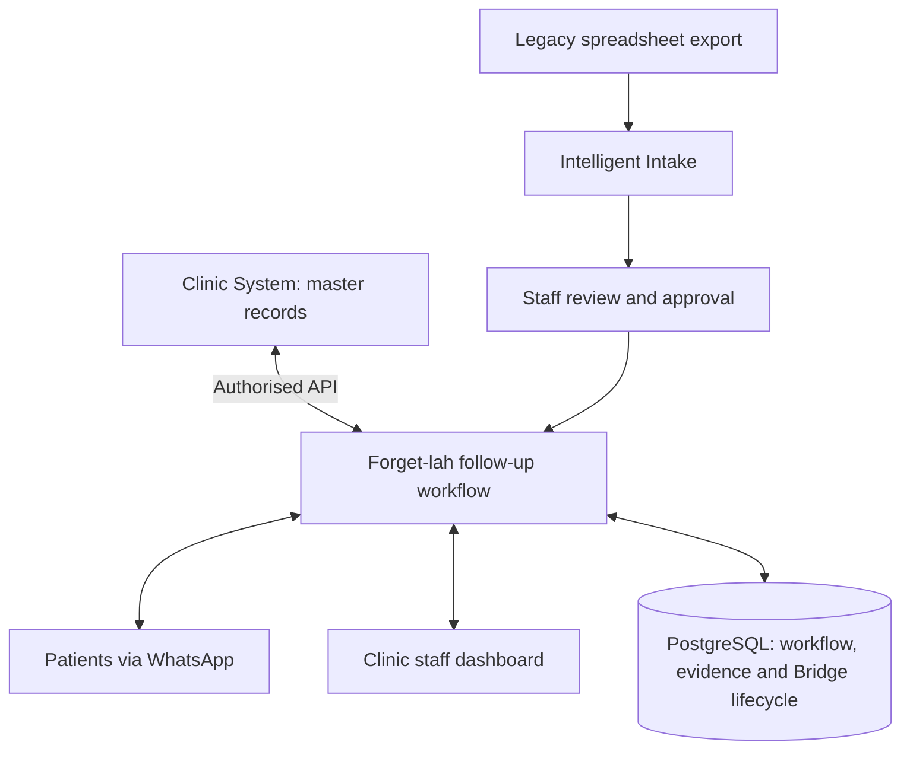

# Forget-lah

**Intelligent patient follow-up. Staff remain in control.**

NUS-ISS Show Me Your Agents | **SP-ARK Agents** | **N63VHYEX**

[Submission documents](docs/submission/README.md) · [Technical document](docs/submission/Forget-lah_Technical_Document.pdf) · [Business proposal](docs/submission/Forget-lah_Business_Proposal.pdf) · [Checks](https://github.com/satworkz/forget-lah/actions/workflows/checks.yml)

## The problem

Dental clinics repeatedly review records, identify follow-ups, contact patients, interpret replies, check doctor instructions and update the correct system. Routine coordination takes staff away from critical clinic work. Patients may forget appointments or prerequisites, face language barriers, or need clarification after clinic hours.

The problem is not sending a reminder. It is everything that happens after the patient replies.

Forget-lah started with dental follow-up, but the same workflow applies more broadly. The dental, scan-prerequisite and ophthalmology examples demonstrate different capabilities of one follow-up layer. Forget-lah is **not a chatbot**, an EMR, a general clinic scheduler or a medical-diagnosis system.

## Start here, judges

1. Read the [business proposal](docs/submission/Forget-lah_Business_Proposal.pdf) for the problem, workflow value and proposed pilot measures.
2. Read the [technical document](docs/submission/Forget-lah_Technical_Document.pdf) for the architecture, agent roles, source ownership, controls and evidence.
3. [Watch the final demonstration on YouTube](https://youtu.be/2pt9Fa5_saQ) (approximately 22:43). The [submission index](docs/submission/README.md) identifies the final file and deployment evidence.
4. Inspect [current capabilities](docs/CURRENT_CAPABILITIES.md), [security](docs/SECURITY_ARCHITECTURE.md), [selective model use](docs/PERFORMANCE.md) and [recorded verification](docs/VALIDATION.md).

The hackathon uses **synthetic clinic records and designated WhatsApp test participants**. Demonstrated workflow outcomes are not production clinical outcomes. Pilot targets and future capabilities are labelled separately.

## How it fits into a clinic



- **API-backed clinics:** the existing Clinic System remains the master record. Reads and permitted updates go through its authorised API. The hackathon source is a synthetic clinic simulator.
- **No-API clinics:** staff-approved Intelligent Intake creates Forget-lah-owned follow-up records in PostgreSQL. Bridge never writes the mock-clinic tables and does not become a full EMR. Follow-up options must come from staff or the appropriate source.
- **Patient communication:** WhatsApp is implemented for controlled testing. Patients can reply or initiate grounded follow-up questions, including outside clinic hours while the service runs. Sandbox enrolment and messaging-window limits apply; production proactive templates are not implemented.

## Agentic reasoning with deterministic control

Three logical agent roles run inside the durable Python worker:

| Role | Responsibility |
| --- | --- |
| Coordinator | Direct the workflow, delegate to specialists and verify completion or staff handoff. Only Coordinator delegates. |
| Engagement | Understand intent and preferences; coordinate supported administrative next steps against source evidence. |
| Preparation | Interpret clinic-approved instructions, prerequisites and contextual conflicts; surface unanswered clinical questions. |

Deterministic code handles clear supported protocol responses, state, mandatory reads, authority, policy, validation, source operations and audit receipts. Models assist with semantic understanding, multilingual meaning and intake mapping. **Model output is a proposal, never proof of identity, consent or booking success.**

Typed proposals pass the policy gateway before tools execute. Durable state and evidence survive individual model calls. Exceptions require named staff ownership. The [organiser model gateway](docs/ORGANISER_GATEWAY.md) is integrated; use is bounded by token, step, retry and shared usage controls.

## What the demonstration shows

| Scenario | Evidence |
| --- | --- |
| Ahmad | Attendance intent and reported dental symptoms are separated; clinical concerns go to staff. |
| Priya | Doctor-defined scan prerequisites constrain the next appointment options and validated change. |
| Alex | Multilingual reasoning identifies a conflict between driving and the clinic's preparation instruction. |
| Intelligent Intake | Semantic mapping, uncertainty review, staff correction, approval and provenance. |
| Staff change | Staff retain control through the same authority, source and policy checks. |
| Security & Audit | Scoped access, saved decisions, source receipts, staff actions and intake evidence. |

## Run locally

Prerequisites: Docker Desktop on Windows, or Docker with Compose on Linux. The default local setup uses synthetic fixtures and simulation; no paid model access is required for that mode.

```powershell
./scripts/dev.ps1 doctor
./scripts/dev.ps1 setup
./scripts/dev.ps1 up
```

On Linux, use the corresponding `./scripts/dev.sh doctor`, `setup` and `up` commands. Open **http://localhost:8080**. Find the generated staff credentials in your private `.env`; never commit them. See the [Linux quick start](docs/UBUNTU_QUICK_START.md) and [maintainer documentation](docs/README.md#maintainer-and-test-operations).

The worker automatically detects eligible cases and queues reviews. Preserve existing data when restarting; do not reset or replay shared demo cases merely to inspect them. External messaging and live-model use require explicit configuration and authorised test participants.

## Implementation and verification

React → Caddy/FastAPI → PostgreSQL, with a persistent Python worker, bounded agent runtime, source adapters and WhatsApp delivery. [Database and source ownership](docs/submission/Forget-lah_Technical_Document.pdf) are explained at a high level in the technical document.

The documented AWS demo is a single-host prototype built with high availability in mind. Durable queues, leases, idempotency and bounded concurrency support recovery; redundant hosts, reactive wake-ups and production capacity validation remain future work. See [performance and planned reactive design](docs/PERFORMANCE.md) and [failure recovery](docs/FAILURE_HANDLING.md).

```text
uv sync --frozen
uv run ruff check .
uv run ruff format --check .
uv run pytest
pnpm --dir apps/web install --frozen-lockfile
pnpm --dir apps/web build
```

PostgreSQL checks require `TEST_DATABASE_URL`; SQLite skips do not prove PostgreSQL concurrency. Live-model tests are opt-in. Recorded test counts belong to their dated runs; consult Actions for the selected commit rather than assuming an old result applies to every revision.

## Security, boundaries and roadmap

Implemented controls include clinic/role scoping, queued authority rechecks, policy-gated actions, model-context minimisation, bounded intake parsing and audit evidence. Free text and intake rows can still contain personal information; minimisation is not anonymisation. No production healthcare certification is claimed.

Future work includes Patient Companion/offline support, voice, caregiver and trusted-identity/consent integrations, follow-up pattern intelligence and additional provider integrations. See [current boundaries and roadmap](docs/NEXT_MILESTONE.md). Historical design material is retained as design history, not as a list of delivered capabilities.
