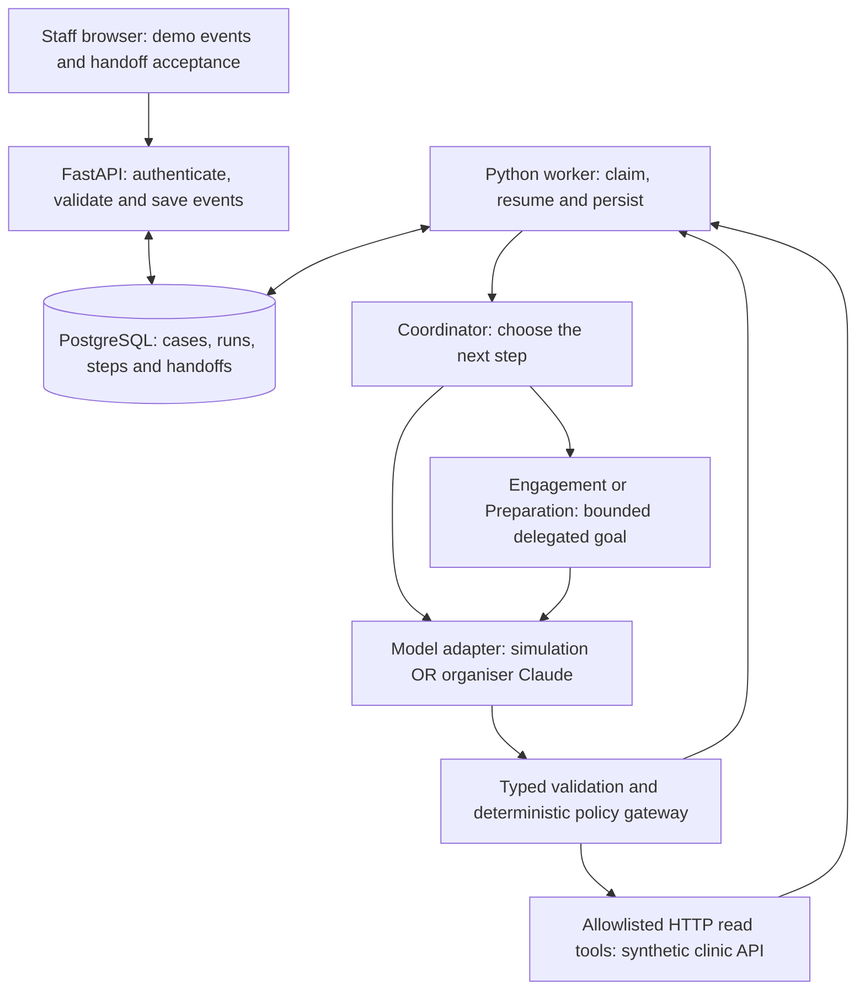

# forget-lah | Run and understand the agents

**Milestone M2a · version 0.2.0 · 11 September 2026**

This increment adds the agent runtime to the working foundation. The staff screen now shows the Coordinator choosing specialists, reading source evidence, waiting, resuming and arranging a staff handoff. The default model is a **deterministic simulation**, so every teammate can run it without a key or paid inference. Direct Claude has been connected and exercised with synthetic dental reviews; see [live validation](LIVE_CLAUDE_VALIDATION.md). A separate organiser adapter is implemented and tested with simulated HTTP responses; its live verification still requires the team's private configuration.

## 1. Start the updated app

Open the project in VS Code, open **Terminal → New Terminal**, and use PowerShell. Start Docker Desktop first.

```powershell
./scripts/dev.ps1 up
```

This rebuilds the app and applies migrations through `0003` automatically. Existing local credentials, patients and foundation evidence are preserved. Open **http://localhost:8080**, refresh the browser and sign in with the credentials in your own `.env` file. No local Python installation is needed for this Docker route.

If this is a fresh clone, follow [TEAM_START_HERE.md](TEAM_START_HERE.md) for installation, then run `doctor`, `setup` and `up`. The earlier PDF describes the M1 foundation; use this document for the new agent buttons and tests.

## 2. Try the three demonstration flows

All patient replies in this milestone are **staff-entered fictional test events**, not authenticated patient messages. Source reads are real HTTP calls to the internal synthetic clinic service. No WhatsApp/SMS/call, reminder or appointment update is sent.

### Flow A — dental recall, two specialist reviews and an owned handoff

1. Find **Mr Lim (demo)** and select **Open agent review**.
2. In **Agent activity**, check the **SIMULATION MODE** label and select **Start agent review**.
3. Allow roughly 10–20 seconds locally. The timeline shows the Coordinator reading context, delegating to Engagement, Engagement reading context and then waiting. Every proposal has its own gateway verdict.
4. In the reply box, enter **Can I come next Friday? What should I bring?** and select **Submit demo reply**.
5. Allow roughly 20–40 seconds. The Coordinator reads the case again, delegates to Preparation, inspects its instruction/prerequisite evidence, then delegates to Engagement to review the date request. Both specialists return evidence references and a result code.
6. The run becomes **escalated** with an **AMBER** handoff. The current read-only tools cannot arrange another date, so a staff member must take over. The clinic source still owns appointment management.
7. Select **Accept handoff as me**. After the Coordinator checks the recorded staff acceptance, the run becomes **completed**. The named owner is visible. **The staff task remains open**; completion means automation has reached an owned handoff.

Use **Inspect source result** to see actual returned data. Use **Inspect validated decision and gateway verdict** to understand why a step was allowed. These are structured decisions and evidence, not private model reasoning transcripts.

### Flow B — myopia preparation and attendance intent

1. Open **Alex (demo)** and start an agent review.
2. At the waiting checkpoint, enter **Yes, I will attend. What should I bring?**
3. Check that Preparation reads the synthetic spectacles note and prerequisite status. Engagement returns `PATIENT_CONFIRMED_ATTENDANCE` as an **unverified intent finding**.
4. Check the staff handoff and accept it. The app does not mark a real appointment as confirmed or send clinical instructions.

### Flow C — antenatal staff escalation

1. Open **Priya (demo)** and start an agent review.
2. At the waiting checkpoint, select **Simulate staff-flagged clinical concern**.
3. Check that a **RED** handoff appears with **Application rule** as its origin. This path does not wait for a model call.
4. Accept the handoff. The final completion verdict stays RED, and the staff task stays open.

This button proves the response to an explicit staff flag. Automatic symptom recognition, urgency assessment from text/voice and medical advice are **not implemented**. The antenatal demo does not validate clinical safety or treatment decisions.

### Recovery checks

- **Reload:** refresh the browser while a run is waiting. Its saved state and timeline remain available.
- **Pause:** select **Pause agent** during a queued/running/waiting run. A late model/tool result cannot resume it. Select **Retry agent review** to continue; the earlier reply is retained.
- **Restart:** while waiting, run `./scripts/dev.ps1 down`, then `./scripts/dev.ps1 up`. Sign in again if necessary and reopen the case. Waiting state survives because it is stored in PostgreSQL.
- **Another demonstration:** after completion, select **Start another demo run**. Earlier runs remain in the database; the current UI displays the latest run for the case.
- **No duplicate actions:** if a stale-screen warning appears, read the refreshed state before trying again. The server rejects outdated case versions and conflicting repeat requests.

## 3. Where the agents run



The three agents are **logical roles in one Python worker**, not three containers. In organiser mode, each role calls the same Claude endpoint with different instructions, a bounded goal and current evidence. The worker supplies memory from PostgreSQL on every call; Claude does not access the database or retain the case on its own. No LangGraph dependency is used.

| Component | What its code does |
| --- | --- |
| React staff screen | Calls the staff REST API; polls the active case every 1.5 seconds; shows decisions, tool results, simulated events and ownership. |
| FastAPI routes | Authenticate staff, recheck clinic membership, validate Origin/CSRF, reject stale versions, store idempotent requests and return HTTP 202. They do not wait for model inference. |
| Persistent worker | Claims a run using a database lock and a 120-second lease, restores its checkpoint, executes one decision and persists the result. Network calls occur outside database transactions. |
| Coordinator | Owns the review goal; selects specialists, inspects returned findings/evidence and chooses to continue, wait or escalate. Only it can delegate or complete automation. |
| Engagement | Reads follow-up context; waits for a demo reply; returns an attendance/date/ambiguous intent finding with source evidence. It cannot prove identity or update attendance. |
| Preparation | Reads the approved-instruction and prerequisite tools; returns both evidence references. Synthetic administrative notes only; no generated clinical instruction is delivered. |
| Model adapter | Uses either the explicitly labelled simulation or an HTTPS JSON request to the organiser gateway. Model failures never silently switch to simulation. |
| Policy/tool gateway | Checks the exact request, case version, current staff authority, role, allowed action and evidence. It supplies source identifiers from the application, never from the model. |
| Clinic adapter | Executes only three GET-based read tools. Validates clinic/patient/episode bindings, schema, response size and synthetic status before returning evidence. |
| PostgreSQL | Stores durable state, requests, observations, validated decisions, results, delegation, events, acceptance and a shared live-call budget. |

The loop is **observe → choose a step → validate → read/delegate → inspect result → adapt/wait/escalate**. For example, a mixed date/preparation request uses both specialists; an ambiguous reply produces an ambiguity handoff; a failed source read produces a timed wait or escalation. The simulation demonstrates these branches with fixed rules. Live model behaviour and quality still need evaluation against the organiser endpoint.

## 4. Decision contract and the gateway

The complete JSON Schema is [contracts/agent-decision-v1.json](contracts/agent-decision-v1.json). The Python source of truth is `src/forget_lah/runtime/contracts.py`. Regenerate the exported schema with `uv run python scripts/export_agent_schema.py` when changing that contract.

Every model decision has an application-generated `request_id`, the exact `expected_case_version`, a `step_type` and an allowed `reason_code`. Unknown fields, duplicate JSON keys, unknown enums, wrong types and stale identifiers are rejected. A malformed response receives at most one repair attempt. Invalid raw model text is not saved or displayed.

| Step | Additional fields | Allowed reason codes |
| --- | --- | --- |
| TOOL | `tool_name` | `READ_SOURCE` |
| DELEGATE | `target`, `goal` | `FOLLOWUP_REVIEW_REQUIRED`, `PREPARATION_REVIEW_REQUIRED` |
| RETURN — Engagement | `evidence_ids` | `PATIENT_CONFIRMED_ATTENDANCE`, `PATIENT_REQUESTED_ALTERNATIVE_DATE`, `AMBIGUOUS_REPLY` |
| RETURN — Preparation | `evidence_ids` | `SPECIALIST_REVIEW_FINISHED` |
| WAIT | `wake_after_seconds` | `AWAITING_PATIENT_REPLY`, `SOURCE_TEMPORARILY_UNAVAILABLE` |
| ESCALATE | None | `CLINICAL_REVIEW_REQUIRED`, `AMBIGUOUS_REPLY`, `CAPABILITY_UNAVAILABLE` |
| COMPLETE | `handoff_id` | `STAFF_HANDOFF_ACCEPTED` |

This is a versioned implementation of the earlier design. `RETURN` is the explicit specialist-to-Coordinator report step. Clinical-review findings escalate rather than returning an instruction to the patient.

Example model proposal, with illustrative IDs:

```json
{
  "request_id": "30000000-0000-4000-8000-000000000001",
  "expected_case_version": 7,
  "step_type": "TOOL",
  "reason_code": "READ_SOURCE",
  "tool_name": "get_approved_instructions"
}
```

The gateway understands this by parsing it into a typed Python `ToolDecision`. It then looks up the saved request and checks the current role. Preparation can read this tool; Engagement cannot. A reason code describes the proposal; it does not grant permission.

An allowed verdict records `request_id`, `case_id`, `case_version`, `action`, `policy_version`, `decision: ALLOW`, `risk` and `reason_codes`. Only after this check does the application call the tool. The result is stored separately:

```json
{
  "tool_name": "get_approved_instructions",
  "status": "succeeded",
  "source_version": "synthetic-v1",
  "data": {
    "instructions": [{
      "instruction_id": "DEMO-MYOPIA-NOTE",
      "version": "1",
      "locale": "en-SG",
      "approved_text": "Demo clinic note: bring your existing spectacles if you have them.",
      "synthetic": true
    }]
  },
  "error_code": null,
  "retryable": false
}
```

The next model request includes this actual result and its step ID. Preparation must cite successful instruction **and** prerequisite evidence from its own current delegation. Coordinator completion requires a matching handoff with recorded staff identity and acceptance time. Neither success nor authority can be supplied by a model assertion.

**Green** permits bounded reads, delegation and waiting. **Amber** requires staff ownership for ambiguous requests or unavailable capabilities. **Red** routes an explicit staff concern or model-proposed clinical escalation to staff. These are application action controls, not a medically validated triage system.

## 5. Requests and database state

| Staff API | Request / response |
| --- | --- |
| `GET /api/cases/{case_id}/agent` | Current case version; latest run; steps, specialist delegations, staff events and handoff. Clinic-scoped session required. |
| `POST /api/cases/{case_id}/agent/runs` | `{ "expected_case_version": 1 }`; returns 202 with `run_id` and queued/current status. |
| `POST /api/cases/{case_id}/agent/events` | `expected_case_version`, `run_id`, `kind`, `content`; returns 202 with `event_id` and status. Kinds: `demo_reply`, `clinical_concern`, `pause`, `retry`, `accept_handoff`. |

Both POSTs require the existing session, exact allowed Origin, `X-CSRF-Token` and an `Idempotency-Key` of 8–64 letters/digits/hyphens/underscores. The same key with the same actor and request body returns the earlier operation; conflicting reuse or a stale version returns 409. The browser sends these automatically. An accepted request is not a completed action.

Migration `0002` adds six tables; migration `0001` is unchanged:

| Table | Main persisted fields and constraints |
| --- | --- |
| `agent_run` | Clinic/case, immutable start key/version/actor, current authorising staff, mode, status, goal, active role, checkpoint JSON, step count, availability and lease token/expiry. Unique clinic/start key; composite clinic/case foreign key. |
| `agent_step` | Request ID, run/clinic/case, sequence, observed case version, role, origin, status, attempts, observation, decision, policy, actual tool result, safe error code and optional reported token counts/latency. Unique run/sequence. |
| `agent_delegation` | Parent run, event ID, target role, goal, active/returned/aborted status, start sequence, returned reason code and evidence IDs. Only one active delegation is permitted by the locked runtime. |
| `agent_event` | Run/clinic/case, client idempotency key, expected case version, staff actor, event kind/content and timestamp. Unique run/client key. |
| `staff_handoff` | Run/clinic/case, reason, Amber/Red risk, accepting staff identity/time. One handoff per run; acceptance is not clinical resolution. |
| `model_budget` | Shared organiser budget row, UTC day, reserved call count and next permitted call time. Locked across worker processes. |

Run states: `queued → running → queued/waiting/escalated/paused/completed`. A waiting reply consumes no polling inference. An expired lease can be reclaimed; stale callbacks cannot commit. GET tools may be replayed after a crash. An interrupted model request may be billed even when its result cannot be saved; this is not an exactly-once inference guarantee.

The foundation case stays `NEW` in this milestone. Use **agent run status** for workflow progress. The case remains a source-derived follow-up record, not a new appointment-management record. No preference, patient-consent or booking tables are implemented yet.

## 6. Organiser Claude configuration

You can now use your own Anthropic account through `anthropic` mode. Follow [CLAUDE_SETUP.md](CLAUDE_SETUP.md) for the supported direct API configuration, connection check and later provider switch. Migration `0003` adds this mode without changing existing run evidence. The call budget applies to both live providers.

The adapter follows the public [starter kit](https://github.com/kenken64/ShowMeYourAgent-Starter-Kit): an Ollama-style `/api/chat` endpoint, JSON decisions in assistant text, `X-API-Key` authentication and instructions carried in the user message. It does not depend on native tool-call support or LangChain/LangGraph compatibility. Confirm the latest private email matches this contract before a live run.

1. Obtain the team's **private URL and key** from the latest organiser email. Never put the key in chat, Git, a screenshot, test fixture or shared document.
2. Finish or pause simulation runs. Open the untracked `.env` locally and add:

```dotenv
AGENT_MODEL_MODE=organiser
LLM_GATEWAY_URL=https://YOUR-ORGANISER-GATEWAY
LLM_GATEWAY_API_KEY=YOUR-PRIVATE-TEAM-KEY
LLM_MODEL=global.anthropic.claude-sonnet-4-5-20250929-v1:0
AGENT_DAILY_CALL_LIMIT=40
AGENT_REQUEST_MAX_BYTES=8000
AGENT_MIN_INTERVAL_SECONDS=2
```

3. Use the exact private URL, retaining any required path prefix. The adapter adds `/api/chat` if absent. Run `./scripts/dev.ps1 up` to recreate services with the new configuration.
4. Verify **ORGANISER MODEL MODE**, then start one fresh run using synthetic data. Every model-origin step should show its validated decision or a safe error code. The mode label indicates configuration, not a verified successful model call.
5. Check actual gateway usage with the organiser. A full demonstration uses several model calls. Keep API access and large-prompt compatibility testing separate from the final presentation.

Changing mode never converts an existing run: the worker pauses it with `MODEL_MODE_CHANGED`. Finish existing runs in their original mode, or choose a case without an active run. For a completed case, **Start another demo run** uses the newly configured mode.

Limits: 24 decision steps per run; 4 Coordinator steps per event; 6 specialist steps per delegation; 2 model attempts per saved request; 40 reserved live-model calls per UTC day by default. Resuming does not reset the run budget. A source retry waits 30–300 seconds. Provider retries are bounded; 401/403 pause for operator investigation, and no redirect is followed. Payload cap is a conservative local setting, not an assertion of the organiser's actual limit.

The call counter includes reserved attempts, including some requests that fail before inference. It is **not a dollar balance** and cannot measure other applications or Lightsail usage. Token counts are shown only when returned by the gateway. Credit monitoring remains necessary in the organiser platform. Default mock mode makes no organiser calls.

## 7. Team verification and remaining work

```powershell
./scripts/dev.ps1 test
```

This builds the test image and runs protocol, policy, workflow, authentication and real PostgreSQL concurrency/migration checks against isolated test data. It does not call a live LLM. See [VALIDATION.md](VALIDATION.md) for recorded results and limits.

The next increment is a patient-facing conversation with trustworthy identity/consent, followed by controlled source-owned booking operations. Staff MFA, patient authentication, WhatsApp/SMS/voice, real clinical rules, patient preferences, uploads, mobile push, calendar, Singpass and Terraform remain future work. This local demonstration is not ready for real patient data or public hosting.

The engineering tests are separate from the proposed **60 hackathon evaluation scenarios**. Model intent accuracy, clinical escalation quality, language inclusion, staff time saved and live endpoint reliability require their own measured evaluation. Do not present simulation results as evidence of Claude quality or medical safety.

## 8. What the model receives and how JSON becomes an action

Each request contains a role instruction, the current event and case version, source-tool results, completed specialist reports and the permitted decision shapes. `reason_code` is a constrained result code; it is not a private reasoning transcript. For Engagement, `PATIENT_REQUESTED_ALTERNATIVE_DATE` means that the fictional reply expresses that intent. It cannot authorise a booking change.

The model also receives `return_requirements`: the required read tools, which ones are still missing and the eligible evidence IDs from its own current delegation. Preparation must read both approved instructions and prerequisite status. Engagement cannot report reply intent before a reply event exists. A specialist already returned for an unchanged event is omitted from the next delegation choices; a new reply permits a new review.

The direct Claude adapter derives a JSON schema from the Python decision contracts and sends it in `output_config.format`. Its transport response is `{ "decision": { ... } }`. The adapter checks and unwraps that envelope. The organiser adapter receives the decision schema in its text prompt and returns the decision object directly, because native structured-output support at that gateway has not been established. The application contract remains the same for both.

Native schema constraints help prevent extra fields and mismatched delegation target/reason pairs. They do not prove identity, source evidence, authority or clinical safety. The application still validates all original length/range constraints, request ID, current case version and gateway policy before executing any tool. An invalid response or rejected proposal is retained and pauses or follows the bounded retry rules; it is never silently converted to success.

The provider schema contains protocol constants only, with no patient identifiers or evidence IDs embedded in it. For native schema support and limitations, see [Anthropic structured outputs](https://platform.claude.com/docs/en/build-with-claude/structured-outputs).
