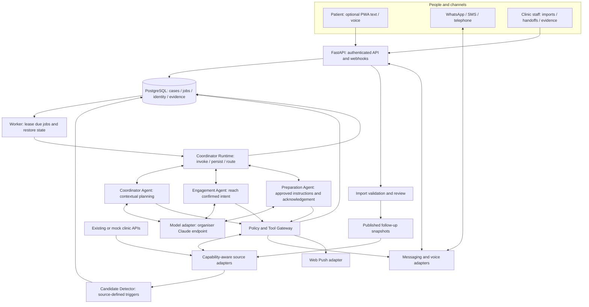

# forget-lah: architecture and contracts

**Current feature reference:** [Feature guide and patient memory](../FEATURE_GUIDE.md) documents implemented behavior, all demo capabilities, preference tests and remaining limitations. Migration `0006` extends time preferences to attributed patient concerns; this supersedes earlier time-only descriptions.

Implementation addendum (16 September): [Adaptive follow-up](../ADAPTIVE_FOLLOWUP.md) adds Coordinator `ASSESS_BARRIERS`, deterministic filtering of source slots, preparation callbacks, an evidence-derived plan panel and explicitly consented time preferences in `patient_preference` (migration `0005`). The existing three-agent delegation and policy boundaries remain. Persistent preferences are editable memory, not model training. The detailed v2.1 design below contains future capabilities that are not all implemented.

10 September 2026 | v2.1 | Proposed implementation | Read the requirements register and platform review first

## 1. Architecture decision

Build a **modular monolith**: one Python backend codebase, a separately running durable worker, one React frontend with patient and staff routes, and PostgreSQL. Modules have clear interfaces without making every logical component a server. External systems are accessed through adapters. The patient-follow-up module remains specific to clinics; future generic reminder domains are not implemented.

Deployment baseline: Docker Compose on one organiser-permitted Lightsail instance. Containers are reverse proxy/static web, FastAPI, worker, PostgreSQL and a synthetic clinic API. The synthetic clinic uses an isolated database/user. This is a single-server hackathon deployment with a single point of failure, not high availability. Measured load tests and recoverability support a credible scaling path.

The runtime model is the organiser's **Claude Sonnet 4.5 JSON endpoint** described in the attached slide. Codex/Astra is our development assistant, not the runtime model of forget-lah. No direct Bedrock credentials, native tool calling, arbitrary AWS service permission or speech model access is assumed.

The latest platform clarification preserves this architecture. A direct Python HTTP adapter will implement the organiser contract, while our typed agent loop controls tool execution. [Guide 05](forget-lah_05_Platform_Alignment.md) records the documented transport, compatibility limits and required live checks. A personal AWS environment must use the same deployable release and permitted service shape; changing accounts must not change clinical or agent logic.

## 2. High-level components



Arrows show responsibility and data flow; every tool result returns to the requesting runtime/agent. Every consequential effect, including rule-selected actions, crosses the gateway. Patients never access the database or model endpoint directly. The frontend calls only FastAPI.

| Component | Technical implementation and responsibility |
|---|---|
| Patient and staff frontend | React + TypeScript + Vite; one repository/build, separate route bundles and role-specific views; patient service worker scope is /patient/ |
| FastAPI | Python REST API; Pydantic validates request/response shapes; authenticates sessions/webhooks, checks resource access and persists events through SQLAlchemy/Psycopg |
| PostgreSQL | Durable relational state: identity links, consent, source provenance, cases, outstanding questions, jobs, messages, agent checkpoints and tool evidence |
| Candidate Detector | Ordinary Python rules read upcoming/no-show/source recall conditions; deduplicate and transactionally create a case and job; it never invents clinical due dates |
| Persistent Worker | Python process leases due PostgreSQL jobs, restores current state, runs bounded work, saves progress and releases the lease; waits live in the database |
| Coordinator Runtime | Python state machine and agent runner; validates transitions, routes obvious events, builds scoped context, invokes the relevant agent and enforces budgets |
| Three agents | Separate goals, prompts and tool allowlists over the same model adapter; each can choose and adapt permitted actions based on observed tool results |
| Model adapter | Python httpx client translating AgentInput to the team endpoint contract; extracts model text and available usage metadata; exact envelope, limits and error handling are verified in the early integration spike |
| Policy/Tool Gateway | Python schema checks, role/state/capability checks, identity/consent enforcement and allowlisted function dispatch; makes no permission decision by asking Claude |
| Source adapters | Python interfaces for reading records/instructions and, when supported, searching or committing source-owned bookings |
| Import service | Parses strict CSV/TXT templates, quarantines uploads, validates and previews differences, and publishes staff-reviewed snapshots; not a calendar engine |
| Messaging/voice adapters | Proposed Twilio integration for WhatsApp/SMS/turn-based calls plus a deterministic test provider; normalise callbacks and actual delivery results |
| Push adapter | Standards-based Web Push with VAPID; protected subscription storage; generic notifications contain no patient/clinical details |
| Identity adapter | Demo identities initially; patient Singpass integration when staging credentials/access are available; backend issues its own scoped session |
| Reverse proxy | Caddy serves the compiled frontend and HTTPS, proxies /api and /webhooks, and bounds upload size; no public database or worker port |

Use Python 3.12, Pydantic 2, SQLAlchemy 2, Psycopg 3 and PostgreSQL 17 as conservative baselines; lock supported tested patch versions during bootstrap. Use a supported Node LTS and lock frontend dependencies. These are chosen baselines, not a claim that each is the latest release.

**Orchestration choice:** implement a small, typed Python agent loop with explicit persistence and tool results. Do not add LangGraph/Strands, Redis, Celery or a vector database simply for a diagram. Reconsider a framework only through a measured compatibility decision; it must preserve the same checkpoints, permissions and model adapter. Platform quality is demonstrated by clean, tested orchestration and idiomatic use of our selected frameworks.

The organiser LLM gateway is the remote model-access service. Our Policy/Tool Gateway is application code that authorises patient actions. They are different components. No remote gateway, model proposal or framework can replace the local permission and evidence checks.

## 3. Agents and observable intelligence

| Agent | Goal and contextual decisions | Tools and boundaries |
|---|---|---|
| Follow-up Coordinator | Achieve an evidenced follow-up outcome; choose the next specialist for a mixed preparation/scheduling reply, revise the plan after failure, wait or hand off | delegate_engagement, delegate_preparation, schedule_followup, request_escalation, propose_case_closure; only this role may propose delegation |
| Patient Engagement | Establish confirmed attendance or an explicitly confirmed alternative; interpret language/date preferences, clarify, search, respond to a slot conflict, choose a permitted channel | send_approved_message, search_slots, confirm_attendance, book_recall, reschedule_appointment, save_confirmed_preference, schedule_voice_call, record_date_request, request_escalation; source capabilities restrict the actual list |
| Visit Preparation | Deliver applicable approved instructions and establish acknowledgement; identify an unresolved prerequisite or clinical question | get_approved_instructions, check_prerequisite_status, send_approved_message, record_preparation_ack, request_escalation; no generated medical instructions |

Each role follows **observe -> decide -> tool/delegate -> inspect actual result -> adapt, wait or escalate**. A classifier that returns intent and ends is insufficient. Demo a slot conflict followed by a revised search/clarification, and a mixed preparation/date request that changes the Coordinator's delegation.

The runtime uses code for due dates, deduplication, exact buttons, delivery statuses, permissions and obvious routing. It invokes Claude for ambiguous language, contextual planning and adaptation. The UI labels `decision_origin=rule` or `model`; it never displays a fictional model call.

One case has one active specialist. Specialists cannot recursively delegate or expand their permissions. A specialist's escalation request immediately pauses routine actions and creates an idempotent staff task through the gateway; it does not wait for another model's agreement.

Initial tunable engineering limits: six decisions per specialist activation, four Coordinator decisions, sixteen decisions across an activation, delegation depth one, one malformed-output repair attempt, bounded HTTP timeouts and a shared wall-time/token budget. Quota values must fit the organiser usage plan. WAIT persists a checkpoint and ends the activation; a later event restores it. Cumulative contact attempts do not reset when an activation restarts.

## 4. State, source authority and completion

Case states: NEW, WAITING_REPLY, WAITING_SLOT_SELECTION, WAITING_SLOT_CONFIRMATION, WAITING_PREPARATION_ACK, WAITING_PREFERENCE_CONFIRMATION, ESCALATED, CLOSED. Track pause/risk, appointment outcome, preparation outcome and handoff status separately. An escalated case may already have a confirmed appointment.

| Trigger | Authority and suppression |
|---|---|
| Upcoming | Source has a current scheduled appointment inside the configured reminder window; suppress cancelled, completed, opted-out or already resolved episodes |
| Missed appointment | Source explicitly records a no-show/missed visit; do not infer no-show merely because the start time passed |
| Due/overdue routine recall | Source defines the recall due date and episode; check for a linked future booking before contacting |

The existing clinic API owns booking, slot capacity, attendance, recall plans and approved instructions. With imports, the clinic's published snapshot is evidence of those external facts as of a timestamp; forget-lah does not acquire authority to invent or change them.

Routine closure requires the verified outcome for the specific case: attendance intent recorded for a current appointment, or source-confirmed booking/reschedule; plus required instruction acknowledgement and no unresolved blocking issue. Imported attendance intent may be recorded locally and exposed to staff as such. It must not imply write-back to an absent clinic system. Reading an instruction does not prove a test is complete or that the patient attended.

An owned staff handoff requires a named staff member's acceptance. Creating an unclaimed queue item does not complete the handoff. An accepted handoff ends automated responsibility but remains an unresolved staff task until resolution. Opt-out stops contact immediately and is recorded as a distinct stopped outcome, with staff follow-up when applicable.

## 5. Two clinic source modes

### Connected API mode

`SourceCapabilities` declares can_read_schedule, can_read_recall, can_read_approved_instructions, can_confirm_attendance, can_search_slots, can_book_recall, can_reschedule_atomically and can_query_operation. Only supported tools are exposed. Missing safe mutation semantics means collect intent and hand off.

Our synthetic clinic API implements GET appointments/recall-plans/followup-context/instructions/slots/operations and POST attendance-confirmations/book/reschedule. Responses include source versions. A source transaction enforces slot exclusivity, expected version and idempotency. The original appointment is retained on failed reschedule; never emulate reschedule by unsafe cancel-then-create.

### Reviewed import mode

MVP uploads: UTF-8 schedule CSV, plus CSV instruction records or plain TXT patient-facing notes linked to a specific patient/episode. Staff sees row errors, exact source timestamps and a change preview, confirms patient mappings/contact authority, and publishes. Raw desk notes are not automatically patient-facing instructions; staff must approve the exact text, language, applicability and expiry.

Pipeline: **upload -> quarantine/validate -> draft preview -> authorised review/publish -> versioned snapshot -> detector -> normal follow-up agents**. Source approval happens at onboarding/publication, not before every routine reminder.

Initial engineering limits: schedule CSV <=5 MB and 500 rows; TXT <=1 MB. Limits are configurable. Parse streamed/bounded input, reject unrecognised formats and duplicate conflicting IDs, store outside the web root, use generated filenames and never execute spreadsheet formulas. Neutralise formula-leading characters on CSV export. Do not silently partially publish: reject the batch until blocking errors are corrected.

Scanned PDFs/images are a stretch extraction-to-draft flow only, behind file scanning/sandboxed decoding and staff review. The MVP does not accept an unsupported image as if it had been safely interpreted. LLM/OCR text must never auto-create contact permission, clinical instructions or reminders.

Snapshots are revisioned. Each row has a stable source record key; repeat upload is idempotent; conflicting/stale revisions return 409. Missing rows are not cancellations: require an explicit status or a reviewed reconciliation. Pause affected pending actions when schedule/instruction versions change and revalidate acknowledgements. A configurable freshness limit stops outreach using stale sources; 24 hours is only a synthetic-demo setting, not a clinical rule.

No slot search/book/reschedule in import mode. A request to change date becomes a structured preference plus owned staff handoff. Staff resolves by recording the result from the real clinic workflow and publishing a new source snapshot. UI contains imports, cases, responses and handoffs; no drag-and-drop booking calendar, slot editor or patient chart.

## 6. Patient PWA and channels

The optional PWA opens from a normal browser link and can be installed to the home screen. React patient routes expose: current follow-up task, text/voice conversation, exact confirmation buttons, approved instructions, preferences, notification settings, calendar export and request staff help. Avoid a general medical chatbot.

The PWA and WhatsApp conversations share one case, one outstanding question and one history of authoritative evidence. A patient switching channels resumes that case after authentication. Simultaneous replies are deduplicated and checked against question and case version; do not create independent agents for each channel.

**Voice MVP:** push-to-talk through a SpeechInputAdapter using browser speech recognition on an explicitly tested browser/device/language. Show the transcript for correction and explicit Send before using it as a message; do not commit booking changes from a misheard phrase. Read-aloud uses supported device voices and only approved patient-facing wording. Browser speech support is uneven and some implementations use a remote recognition service; obtain informed opt-in, use synthetic demo content and show text/OS-keyboard dictation alternatives. This is a constrained demo channel, not a promise of universal offline/private speech. [MDN SpeechRecognition](https://developer.mozilla.org/en-US/docs/Web/API/SpeechRecognition).

Telephone fallback remains provider-based speech/DTMF. It identifies the clinic/automated nature, verifies the recipient using the approved flow, asks one question at a time and offers a staff callback. No default call recording, no clinical detail in voicemail, no inference that an answered call means confirmation. Do not infer clinical urgency from tone alone. Provider speech output is transcript input to the same typed agent loop.

**Push:** use service worker + Push API + Notifications API and VAPID. Ask permission only after an explanatory user action. On iOS/iPadOS 16.4+, Web Push applies to home-screen web apps; installation/permission and actual device testing matter. Delivery is best-effort, not a reliable clinical alarm. Generic payload: 'You have a follow-up update. Open forget-lah.' Fetch details only after authentication. [WebKit guidance](https://webkit.org/blog/13878/web-push-for-web-apps-on-ios-and-ipados/).

**Calendar:** authenticated explicit 'Add to calendar' downloads an RFC 5545 .ics file for a source-verified appointment. Use a stable opaque UID, SEQUENCE and correct UTC/timezone handling. Default event title is generic; do not export preparation notes, record identifiers or sensitive specialty text. This is a one-way user-controlled copy, not a booking action. Mobile clients may duplicate imports or retain old dates; show that changes must be updated/removed by the user. No access to the patient's calendar or automatic synchronisation in the MVP. [iCalendar standard](https://www.rfc-editor.org/rfc/rfc5545).

Patient accessibility: large labelled controls, screen-reader semantics, readable contrast, one question per step, visible exact dates, text equivalents for audio and reviewed English/Mandarin text. Voice availability is measured separately. Offer an explicitly authorised caregiver route; do not assume all seniors or all myopia patients can use Singpass or a smartphone.

Outbound WhatsApp requires provider opt-in/template/session rules. Outside the customer service window use an approved template; sandbox behaviour must be tested. Do not send PWA push, SMS, WhatsApp and a call at once: gateway applies confirmed preference, permission, prior replies, attempt limits and contact hours across channels. [Twilio templates](https://www.twilio.com/docs/whatsapp/tutorial/send-whatsapp-notification-messages-templates).

## 7. Authentication, authorisation and Singpass

Authentication answers 'who is signed in?'; authorisation answers 'which patient, clinic and action may they access?'. FastAPI checks both on every request. A hidden frontend button is not security.

Staff MVP: four individually invited accounts, Argon2id password hashes, TOTP MFA for the shared deployment, rate-limited login, expiring server sessions and clinic-scoped roles: staff, supervisor, clinic_admin. One person can hold multiple explicit roles. Admin manages imports/invitations; supervisor handles review/overdue handoff. No shared admin token. Local test credentials are generated privately; CI never sends real OTPs or logs secrets.

Patient MVP: pre-enrolled synthetic patients, a short-lived one-time activation flow and OTP to the registered test contact, issuing a server-side session scoped to linked patient/clinic. Store only hashed activation/OTP/session secrets with expiry, replay protection and attempt limits. A shared/recycled phone is not strong civil identity; do not silently resolve multiple patient links. Source-defined permitted actions and explicit patient/caregiver linkage remain necessary. Dev-only identity simulation is labelled and cannot access real records.

Cookies: Secure + HttpOnly + SameSite, bounded lifetime, session rotation after login/privilege changes, CSRF protection and origin checks for mutations. No bearer tokens in localStorage; no clinical data in service-worker caches. The patient worker caches public app shell only and excludes /api, /auth and /staff. Signed-in responses use Cache-Control: no-store; logout revokes session and clears private in-memory state and relevant device subscription association.

**Singpass track:** implement a replaceable PatientIdentityProvider. Integrate real Singpass Login in staging only once organisation/developer access, application registration, redirect URL and key setup are available. Official portal access requires organisational Corppass authorisation; a personal Singpass login alone is not developer access. The current integration guide uses OIDC and FAPI 2.0. Use reviewed libraries and the assigned app profile: discovery, PAR, PKCE, state/nonce, client authentication, DPoP and ID-token decryption/validation as specified. Never construct a simplified lookalike protocol. [Portal access](https://docs.developer.singpass.gov.sg/docs/singpass-developer-portal-sdp/user-guide/obtaining-access-to-the-singpass-developer-portal-sdp), [integration guide](https://docs.developer.singpass.gov.sg/docs/technical-specifications/integration-guide), [DPoP](https://docs.developer.singpass.gov.sg/docs/technical-specifications/technical-concepts/demonstrating-proof-of-possession-dpop).

After verified callback, backend maps `(issuer, subject)` to an explicitly enrolled patient identity; it does not match by name alone or collect NRIC unnecessarily. Store minimum authorised claims. Request Login rather than broad Myinfo datasets unless a real requirement justifies them. Singpass does not provide contact consent, a clinic staff role, appointment access or caregiver authority. Use staff identity federation later if a clinic provides it; do not force Singpass onto staff service accounts or provider webhooks.

If staging access is unavailable by the first-week decision checkpoint, ship a clearly labelled identity-provider simulation plus working demo authentication and pending integration tests. Never show a fake successful Singpass screen or claim certification/production readiness. Seek actual staging early; it is an access dependency, not an excuse to omit auth.

## 8. Model request, schema and gateway contract

Every invocation receives versioned role instructions + fresh scoped case state + latest event + relevant prior tool observations + actual allowed tool schemas + actual response schema. A schema filename is not enough. Persisted PostgreSQL evidence is memory; Claude does not remember earlier calls by itself. A model summary is never the authority for consent or booking success.

For the initial adapter, put the active role's compact response schema and currently allowed tool definitions in message content. Do not rely on an API-level tools field or provider-enforced JSON schema. Parse the returned text as strict JSON, validate the discriminated union with Pydantic, then ask the local gateway to authorise dispatch. One bounded repair attempt is allowed; a second invalid result causes a safe stop/handoff. Feed actual tool observations into the next call using a role/envelope proved to work with the team endpoint. Measure UTF-8 request bytes as well as token estimates; never trim away mandatory policy or evidence to squeeze through a limit.

Our internal request (teaching aliases stand in for UUIDs; this is not the organiser's wire format):

```json
{
  "schema_version": "2.0",
  "request_id": "REQ100",
  "agent_name": "patient_engagement",
  "instructions_version": "engagement-v2",
  "case_context": {
    "case_ref": "C100", "case_version": 7,
    "state": "WAITING_REPLY", "specialty": "dental",
    "source_mode": "api", "timezone": "Asia/Singapore",
    "source_appointment_ref": "A100", "source_version": "7",
    "last_question_ref": "Q100",
    "last_question": "Can you attend Thursday 17 September?"
  },
  "latest_event": {
    "message_ref": "MSG140",
    "text": "Thursday is difficult. Can I come Friday afternoon?"
  },
  "allowed_actions": ["search_slots", "send_approved_message", "request_escalation"],
  "response_schema_ref": "AgentStep-v2"
}
```

The context builder resolves the version references to instruction text and JSON schemas before sending the model request. The internal permission summary, if sent, is read-only context; the gateway independently reloads trusted evidence. Actual date context includes the reference time and appointment date.

Our developers define the reason-code vocabulary and its meaning. This exact schema fragment belongs in the response contract:

```json
{
  "reason_code": {
    "type": "string",
    "enum": [
      "PATIENT_CONFIRMED_ATTENDANCE",
      "PATIENT_REQUESTED_ALTERNATIVE_DATE",
      "AMBIGUOUS_REPLY",
      "CLINICAL_REVIEW_REQUIRED"
    ]
  }
}
```

This is the shared starter vocabulary, not the entire AgentStep schema. Extend it explicitly for other tools (e.g. SOURCE_SLOT_UNAVAILABLE, SOURCE_WRITE_UNAVAILABLE, PREPARATION_ACKNOWLEDGED, CONTACT_PREFERENCE_CONFIRMED). Each action-specific branch constrains compatible codes. A clinical review reason cannot authorise a slot search simply because it belongs to an enum. Instructions explain when to select each code; schema validation alone does not prove correct interpretation.

AgentStep is a strict discriminated union with `step_type`: TOOL, DELEGATE, WAIT, COMPLETE or ESCALATE. Every branch forbids extra fields and includes expected_case_version. TOOL has an action-specific arguments schema and compatible reason enum; DELEGATE has target/goal/context references; WAIT has event/deadline within policy; COMPLETE has evidence references; ESCALATE has an allowlisted review reason. The runtime rejects mismatched branches/actions and unknown tools. Dates and enums are validated by Pydantic and business checks, not just a JSON parser.

Example model proposal:

```json
{
  "step_type": "TOOL",
  "action": "search_slots",
  "arguments": {
    "local_date": "2026-09-18",
    "timezone": "Asia/Singapore",
    "time_band": "afternoon"
  },
  "reason_code": "PATIENT_REQUESTED_ALTERNATIVE_DATE",
  "expected_case_version": 7
}
```

Plain Python reads `action`, looks up a known function, validates `arguments`, and audits `reason_code`. It does not execute model-authored Python, SQL or arbitrary URLs. Illustrative code, not a delivered implementation:

```python
step = AgentStepAdapter.validate_json(model_text)
ctx = load_trusted_context(job.case_id, job.agent_name)
check_case_version(step.expected_case_version, ctx.case_version)
check_action_reason_consistency(step)
tool = registry.allowed_tool(ctx.agent_name, step.action)
args = tool.validate_arguments(step.arguments)
decision = policy.evaluate(ctx, step.action, args)
persist_policy_decision(decision)
if decision.decision != "ALLOW":
    return handle_block_or_review(decision)
return execute_with_revalidation_and_evidence(ctx, tool, args)
```

Gateway output is generated by application code after real checks:

```json
{
  "request_id": "REQ100", "case_ref": "C100", "case_version": 7,
  "action": "search_slots", "arguments_hash": "sha256:DEMO_DIGEST",
  "risk": "GREEN", "decision": "ALLOW", "policy_version": "demo-v2",
  "reason_codes": ["CONTACT_AUTHORITY_VALID", "SOURCE_TOOL_SUPPORTED"]
}
```

Meaning: this request may perform this action with these arguments on this case state. It is not blanket permission. Revalidate changes before execution; patient and clinic identity come from trusted session/job/evidence, not model assertions. Claude's singular `reason_code` explains its proposal; gateway `reason_codes` record application checks. Neither means a booking succeeded.

ToolResult includes action, status [succeeded, failed, outcome_unknown], source_version, safe data/evidence refs and retryability. The agent observes a failed/empty slot search and can adapt. Only a successful source operation or reconciled source state supports booking success.

## 9. API surface and consistent evidence

| Route group | Representative API contracts |
|---|---|
| Auth | POST /api/v1/auth/login, /otp/verify, /logout; GET /api/v1/auth/singpass/start and /callback; server-controlled identity bindings |
| Patient | GET /api/v1/patient/cases; POST /cases/{id}/messages; POST /cases/{id}/confirmations; GET /cases/{id}/calendar.ics; GET/PATCH /preferences |
| Push | POST/DELETE /api/v1/patient/push-subscriptions; validate endpoint/keys and bind to authenticated user/device |
| Staff | GET /api/v1/staff/cases and /cases/{id}/timeline; POST /escalations/{id}/claim and /resolve; POST /cases/{id}/pause |
| Imports | POST /api/v1/staff/imports; GET /imports/{id}/preview; POST /imports/{id}/publish with expected revision and hash; explicit review permissions |
| Providers | POST /webhooks/{provider}/messages, /message-status, /voice-input and /voice-status; validate actual provider signatures first |
| Operations | GET /health/live and /health/ready; authenticated sanitised evaluation reports and queue metrics |

Internal event types distinguish patient replies, delivery receipts, contact revocation, source changes and timers. Reply events carry event_id, provider_event_id or client_message_id, message_ref, channel, received_at and validated question/case binding. Webhook signature proves provider origin, not patient identity. Provider errors and expired sessions must not bypass permission checks.

202 means accepted/queued, not completed. 409 means stale version, conflicting idempotency content or competing slot/claim; 422 means invalid input. Mutation requests use Idempotency-Key; same key and content returns the recorded result, different content is rejected. Dates store UTC and render exact Singapore dates; case version and external source version are separate.

Require explicit confirmation bound to an unexpired offered slot/question and patient/representative authority. A generic 'yes' to a preference question must never confirm a booking. Save the actual confirmation event, selected offer, source version and result. An LLM boolean is not sufficient evidence.

## 10. Autonomy and security boundaries

| Level | Behaviour | Example |
|---|---|---|
| Green | Autonomous permitted administrative work after checks | Confirm attendance, deliver approved text, search valid slots, commit an explicitly confirmed safe source operation |
| Amber | Pause affected action, clarify within limits or obtain staff review | Ambiguous date, stale imported schedule, uncertain identity, missing prerequisite evidence, unsupported source write |
| Red | Stop routine automation, create/route staff escalation, track acceptance | Predefined concerning patient report or clinical question requiring approved review; source policy supplies the routing |

These are workflow authority levels, not medical severity diagnoses. Model tone/confidence cannot downgrade a concern. Contact opt-out and security attacks have distinct stop/block policies; they are not automatically clinical emergencies.

Privacy design: minimise model context, encrypt contact/message/identity data, isolate clinic rows, control upload access, redact logs, protect keys, bound retention and map all external processors. Singapore hosting does not establish that speech/model/push processing stays in Singapore. The exact organiser logging/retention/region must be obtained. These controls support obligations, not a compliance certification. [PDPC obligations](https://www.pdpc.gov.sg/data-protection-obligations).

Prevent prompt injection by separating instructions from untrusted patient/upload/tool text, allowlisting tools and arguments, never accepting identity/consent claims from model text and avoiding unrestricted SQL/filesystem/network tools. Push endpoints and source URLs need server-side destination validation, blocked private/link-local targets, no redirects to arbitrary hosts and bounded egress to prevent SSRF. Model and provider credentials stay server-side.

## 11. Reliability and honest scaling

Use PostgreSQL jobs/outbox and short row-lock transactions with SKIP LOCKED. Persist pending operations before external effects; acknowledge webhooks after durable storage; deduplicate event IDs. Recheck state, consent, source freshness and contact limits immediately before sending. Unknown remote outcomes are reconciled before retrying; local idempotency cannot guarantee global exactly-once delivery.

Scaling path: stateless APIs and bounded workers can gain replicas; per-case concurrency controls and shared PostgreSQL preserve correctness. Index due jobs, clinic/case queries and provider IDs; bound connection pools and backpressure the model/provider. Single-server PDF/file storage and database are explicit limits. Future shared storage, database HA and cloud services need permission and measured demand; no new platform is built now.

Trace active agent, goal, observation summary, model/rule origin, tool proposal, policy result, actual tool result, next wait/delegation and evidence. Store no private chain-of-thought. Expose operational counters and a global outbound pause. If the model budget is exhausted, preserve pending cases and surface the dependency problem; never silently claim success or switch to an unapproved model.
