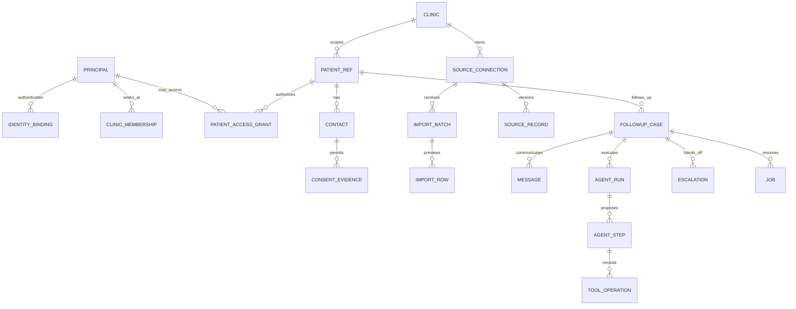

# forget-lah: database design and integrity

10 September 2026 | v2.0 | Proposed schema, not executed SQL or applied migrations

## 1. Database purpose

Yes, forget-lah needs PostgreSQL. It stores confirmed preferences, identity/consent evidence, imported source provenance, messages, pending jobs, agent checkpoints and handoffs. The model is not the database and does not retain authoritative state between calls.

Use one PostgreSQL 17 instance for the hackathon, with `remind` and `mock_clinic` databases and separate roles. The application accesses the mock clinic only through its HTTP API. Runtime migration credentials are not given to ordinary API/worker processes. Imported records live in forget-lah as published follow-up evidence, not as a second clinical chart.

Notation: PK = primary key; FK = foreign key; UUID = unique identifier; `?` = nullable; timestamptz = timestamp for an instant, handled in UTC; jsonb = bounded structured JSON. All fields not marked `?` are required. Field lists are logical contracts to implement in SQLAlchemy/Alembic. Use checked text enums consistently and forbid unsupported values.

Every patient-related table includes `clinic_id`; composite FKs or equivalent database constraints prevent children referencing another clinic's patient/case. Patient/clinic IDs in requests are not trusted access grants. Parameterised queries are mandatory. Do not infer caregiver relationships from a shared phone.

## 2. Relationship map



## 3. Clinic, patients and sources

### clinic

`id uuid PK; name text; timezone text; active_policy_version text; active boolean; created_at timestamptz`.

One clinic with three specialties is the main demo. Seed an additional isolated clinic solely for access-denial tests; this is not a multi-clinic commercial launch.

### source_connection

`id uuid PK; clinic_id uuid; mode text [api, import]; name text; capabilities jsonb; config_ref text; active boolean; freshness_limit_seconds integer; created_at timestamptz; updated_at timestamptz`.

Capabilities follow Guide 01; credentials are referenced, never embedded in config. API endpoints come from operator-reviewed configuration, never uploaded patient data or model output. Import mode cannot advertise slot search/book/reschedule. Changing capabilities is an audited admin operation.

### patient_ref and source_patient_link

`patient_ref: id uuid PK; clinic_id uuid; display_alias text; active boolean; created_at; updated_at`.

`source_patient_link: id uuid PK; clinic_id uuid; patient_id uuid; source_connection_id uuid; source_patient_id text; mapping_evidence_ref text; created_at`.

Unique `(clinic_id, source_connection_id, source_patient_id)`. Mapping two source identities to one patient requires trusted enrolment/review. Do not auto-merge by name, phone or a guessed NRIC. External IDs remain opaque strings. Names in general logs use synthetic aliases.

### contact, consent_evidence and preference

`contact: id uuid PK; clinic_id uuid; patient_id uuid; source_contact_ref text?; relationship text [patient, authorised_caregiver]; address_ciphertext text; address_lookup_hmac text; authority_ref text?; verified_at timestamptz?; revoked_at timestamptz?; created_at`.

Use authenticated encryption for addresses; keyed HMAC for exact lookup, not a brute-forceable plain hash. Keys live outside the database/repository. Multiple contacts can share an address without gaining each other's patient access.

`consent_evidence: id uuid PK; clinic_id uuid; contact_id uuid; purpose text; channel text [whatsapp, sms, telephone, web_push, portal]; status text [permitted, denied, unknown, revoked]; source_ref text; policy_version text; recorded_at; valid_until?; supersedes_id uuid?`.

Consent changes are append-only evidence. Unknown is not permission. Browser push permission is stored separately and does not replace clinic-purpose consent. Revocation invalidates relevant jobs/subscriptions and is rechecked before effects. Portal interaction permissions and proactive contact permissions are distinct.

`preference: id uuid PK; clinic_id uuid; patient_id uuid; contact_id uuid; kind text [language, channel, contact_window]; value jsonb; status text [suggested, confirmed, superseded]; confirmation_evidence_ref text?; confirmed_at?; created_at`.

Partial unique `(clinic_id, patient_id, contact_id, kind) WHERE status='confirmed'`. Replace confirmed preferences in one transaction. A model can suggest but cannot activate a preference without explicit evidence; preference never overrides consent, supported language or contact hours.

## 4. Identity, sessions and access

### principal, identity_binding, clinic_membership

`principal: id uuid PK; kind text [staff, patient, caregiver]; display_alias text; active boolean; created_at`.

`identity_binding: id uuid PK; principal_id uuid; provider text [demo_password, patient_otp, singpass]; issuer text; subject_lookup_hmac text; subject_ciphertext text?; credential_hash text?; verified_at?; created_at`.

Unique `(provider, issuer, subject_lookup_hmac)`. Store the minimum identifiers; Singpass subject values are sensitive even when pseudonymous. Demo password binding stores Argon2id hash. Never store Singpass credentials. OTP contact control is not upgraded to a stronger assurance level merely by linking a row.

`clinic_membership: id uuid PK; principal_id uuid; clinic_id uuid; role text [staff, supervisor, clinic_admin]; status text [active, revoked]; granted_by uuid; created_at; revoked_at?`.

Unique active principal/clinic/role. Every staff action resolves current membership, not an arbitrary role claim in model/UI input.

### patient_access_grant

`id uuid PK; clinic_id uuid; principal_id uuid; patient_id uuid; relationship text [self, authorised_representative]; scope jsonb; authority_ref text; verified_by uuid?; valid_from; valid_until?; revoked_at?; created_at`.

Scope uses a validated small permission list (read_followup, reply, confirm, manage_preferences). An authenticated caregiver sees only explicitly granted patients/actions. Recheck expiry/revocation on every API call and queued action. Singpass authentication does not create this row automatically without an authorised linkage process.

### auth_session, auth_challenge, mfa_credential

`auth_session: id uuid PK; principal_id uuid; token_hash text UNIQUE; auth_provider text; assurance text; authenticated_at; expires_at; revoked_at?; csrf_secret_hash text; created_at`.

Token itself is sent only as a secure HttpOnly cookie. Hash it in the database. Rotate after login and permission changes; bound inactivity/absolute expiry. Check memberships/grants live, so stale cookies cannot preserve revoked authority.

`auth_challenge: id uuid PK; purpose text [activation, otp, oidc]; secret_hash text; principal_id uuid?; contact_id uuid?; attempts integer; max_attempts integer; expires_at; consumed_at?; protected_protocol_state jsonb?; created_at`.

Store OIDC state/nonce/PKCE/DPoP session material encrypted and short-lived when real Singpass is integrated; never general-log it. Challenges are single-use and rate limited by account/contact and source network. All expiry comparisons use server time. Do not expose whether an arbitrary patient identifier exists.

`mfa_credential: id uuid PK; principal_id uuid; type text [totp]; secret_ciphertext text; recovery_code_hashes jsonb; last_accepted_step bigint?; activated_at; revoked_at?`.

MFA enrolment and recovery are reviewed, not public-registration endpoints. Prevent OTP replay for the same time step; never put TOTP seeds or backup codes in screenshots, test reports or Git.

## 5. Imports and provenance

### import_batch and import_row

`import_batch: id uuid PK; clinic_id uuid; source_connection_id uuid; schema_version text; upload_hash text; storage_ref text; media_type text; byte_count integer; status text [quarantined, invalid, awaiting_review, published, rejected, superseded]; source_as_of timestamptz; expected_source_revision integer; revision integer; uploaded_by uuid; reviewed_by uuid?; approved_at?; published_at?; error_summary jsonb; purge_after?; created_at`.

Unique `(clinic_id, source_connection_id, upload_hash)` for replay handling, with explicit revision semantics. Publish checks current hash, expected revision and reviewer role. One transaction writes accepted source records, audit and detector jobs; a repeat does not publish twice. Re-upload of the same snapshot cannot silently refresh `source_as_of`.

`import_row: id uuid PK; clinic_id uuid; batch_id uuid; row_number integer; source_record_key text; record_type text [appointment, recall, instruction]; normalized_payload_ciphertext text; payload_hash text; validation_errors jsonb; mapped_patient_id uuid?; reviewed boolean`.

Unique batch/row. Critical errors block the batch. Valid rows are previewed without automatically creating outreach. A note containing 'ignore previous instructions' is stored as untrusted text, never as executable agent instructions. Only approved patient-facing instruction records enter the preparation tool's allowed set.

### source_record

`id uuid PK; clinic_id uuid; source_connection_id uuid; patient_id uuid; source_record_key text; record_type text; version text; batch_id uuid?; source_as_of; verified_at; status text; payload_ciphertext text; payload_hash text; approved_by_ref text?; approved_at?; valid_until?; supersedes_id uuid?; created_at`.

Unique connection/key/version. Use immutable versions and an explicit current-record reference or one current-version constraint per key. Payload is validated against AppointmentSnapshot, RecallPlan or ApprovedInstruction schemas. API snapshots needed for evidence can use the same table with bounded retention; avoid mirroring whole clinical records. Staff source publication authorises only the declared purpose/text, not arbitrary content reuse.

Do not interpret an omitted record as cancelled. Explicit status and reviewed changes drive source updates. A change affects linked cases and pending messages; update/invalidation jobs are committed with the source revision. Reject stale updates and conflicting duplicates.

### Import templates

Schedule CSV columns:

```csv
schema_version,source_record_id,source_patient_id,record_type,specialty,status,starts_at,due_at,timezone,source_as_of,instruction_ids
2.0,APT-DEMO-01,P-DEMO-01,appointment,dental,scheduled,2026-09-17T09:30:00+08:00,,Asia/Singapore,2026-09-10T08:00:00+08:00,INS-DEMO-01
2.0,REC-DEMO-02,P-DEMO-02,recall,myopia,due,,2026-09-15T00:00:00+08:00,Asia/Singapore,2026-09-10T08:00:00+08:00,
```

Patient/contact enrolment is a separate reviewed step; this file cannot manufacture contact consent or representative authority. Appointment records require starts_at; recall records require source-defined due_at. Timestamp offsets and timezone must agree; reject ambiguous local times. No inference of medical urgency from specialty.

Instruction CSV columns: schema_version, instruction_id, source_patient_id, source_record_id, version, locale, approved_text, valid_until, acknowledgement_required. Authenticated reviewer identity and approval timestamps are assigned on publication, not trusted from an uploader-entered name. TXT notes require the same metadata through the review form. Demo wording must be visibly synthetic and clinically unvalidated.

## 6. Workflow, messages and patient artefacts

### followup_case

`id uuid PK; clinic_id uuid; patient_id uuid; source_connection_id uuid; source_record_ref uuid?; source_appointment_id text?; source_recall_id text?; source_version text; specialty text [dental, myopia, antenatal]; trigger_type text [upcoming, missed, overdue]; trigger_key text; state text; risk text [GREEN, AMBER, RED]; paused boolean; policy_version text; appointment_outcome text [pending, attendance_intent_recorded, attendance_confirmed_in_source, booked, rescheduled, no_change]; preparation_outcome text; closure_reason text?; active_agent_name text?; active_run_id uuid?; pending_question_ref uuid?; next_action_at?; outreach_attempts integer; version integer; created_at; updated_at; closed_at?`.

Require a valid source episode reference. Unique `(clinic_id, trigger_key)` from stable source episode + trigger kind + policy episode, not polling time. One open case for the same underlying follow-up episode; link recall/appointment changes to avoid duplicates. Source version changes update a case rather than automatically creating another. Index clinic/update and state/next_action_at. Close only through verified evidence rules.

### conversation_question, message and inbound_event

`conversation_question: id uuid PK; clinic_id uuid; case_id uuid; kind text; offered_refs jsonb; case_version integer; expires_at?; answered_by_message_id uuid?; status text [open, answered, expired, superseded]; created_at`.

Only one open question per case. This binding prevents an answer about language from being mistaken for a slot confirmation.

`message: id uuid PK; clinic_id uuid; case_id uuid?; contact_id uuid?; principal_id uuid?; question_id uuid?; channel text [portal, whatsapp, sms, telephone, web_push]; direction text; provider text; provider_message_id text?; provider_call_id text?; provider_turn_ref text?; client_message_id text?; template_key text?; template_version text?; body_ciphertext text?; safe_summary text?; status text [queued, accepted, delivered, failed, received, outcome_unknown]; created_at; received_at?; sent_at?; purge_after?`.

Unique non-null provider/message/direction and portal principal/client_message_id. Store unassigned inbound events without guessing a case. Delivery is distinct from acknowledgement. Call SID does not uniquely identify each speech turn; bind a server-issued turn ID.

`inbound_event: id uuid PK; clinic_id uuid?; provider text; event_key text; event_type text; message_id uuid?; protected_payload_ref text?; status text [received, processed, failed]; received_at; processed_at?`.

Unique provider/event_key. A validated public webhook may precede tenant resolution; only an authorised event-to-contact mapping enables patient actions. Verify signature before trusting provider fields. Bound raw payload retention and avoid dumping entire requests into logs.

### slot_offer, preparation_ack and date_request

`slot_offer: id uuid PK; clinic_id uuid; case_id uuid; source_slot_id text; starts_at; source_version text; expires_at; question_id uuid; offered_message_id uuid; confirmation_message_id uuid?; status text [offered, confirmed, expired, used]; confirmed_at?`.

Offer is not reservation. Source rechecks slot availability on commit. Expired/wrong-case/unconfirmed offers cannot mutate a booking.

`preparation_ack: id uuid PK; clinic_id uuid; case_id uuid; instruction_ref text; instruction_version text; locale text; approved_text_hash text; delivered_message_id uuid?; ack_message_id uuid?; status text [pending, delivered, acknowledged, clarification_required, superseded]; acknowledged_at?; prerequisite_verification_ref text?`.

Unique case/instruction/version/locale. Acknowledgement is not completed preparation or medical clearance. Source instruction revisions invalidate required old acknowledgements.

`date_request: id uuid PK; clinic_id uuid; case_id uuid; requested_window jsonb; evidence_message_id uuid; status text [recorded, handed_off, resolved]; escalation_id uuid?; created_at`.

Import mode uses date_request, not fabricated slot_offer or booking records. An API source lacking safe write capability can use it too.

### push_subscription and calendar_export

`push_subscription: id uuid PK; principal_id uuid; clinic_id uuid; endpoint_ciphertext text; endpoint_hash text; p256dh_ciphertext text; auth_ciphertext text; device_alias text; permission_status text; active boolean; created_at; last_success_at?; revoked_at?`.

Unique endpoint hash; validate destination against supported push services and SSRF controls. Subscription links to an identity/device, never acts as a login credential. Invalidate 404/410 endpoints, reconcile revocation and avoid leaking a previous user's details on a shared device. Push payloads are generic.

`calendar_export: id uuid PK; clinic_id uuid; case_id uuid; principal_id uuid; source_version text; opaque_uid text; sequence integer; content_hash text; exported_at`.

Records the user-requested export, not successful calendar installation or synchronisation. No OAuth calendar tokens or full calendar copy. UI warns that the external copy may become stale.

## 7. Handoff, approvals and execution evidence

`escalation: id uuid PK; clinic_id uuid; case_id uuid; reason_code text; priority text [routine, prompt_review]; route_ref text; status text [open, accepted, resolved]; assignee_principal_id uuid?; ack_due_at; accepted_at?; resolved_at?; resolution_code text?; external_result_ref text?; version integer; created_at`.

One active escalation per case/reason. Atomic claim succeeds for one staff member; conflicts return 409. Accepted requires assignee/time; resolved requires permitted resolution/evidence. Reminder of overdue staff ownership continues even if the automated case records handed_to_staff. Only explicit resolution permits a policy-checked resume.

`action_approval: id uuid PK; clinic_id uuid; case_id uuid; action_hash text; expected_case_version integer; decision text [approved, rejected]; staff_principal_id uuid; expires_at; consumed_at?; created_at`.

Approval is bound to exact action/arguments/case/version, expires and can be consumed once. It never permits model-generated clinical advice.

`tool_operation: id uuid PK; clinic_id uuid; case_id uuid; action text; idempotency_key text UNIQUE; request_hash text; requested_by_run_id uuid?; requested_by_step_id uuid?; status text [pending, succeeded, failed, outcome_unknown]; source_operation_id text?; source_version text?; result_summary jsonb?; started_at; finished_at?`.

Persist pending before sending. Same key + different request hash fails; do not use a fresh key after a timeout. Reconcile source operation status/current state before replay. Unknown message/call outcomes pause or reconcile instead of blindly sending twice.

## 8. Agents, jobs and audit

`agent_run: id uuid PK; clinic_id uuid; case_id uuid; agent_name text; parent_run_id uuid?; goal text; status text [running, waiting, completed, escalated, failed]; expected_case_version integer; prompt_version text?; model_ref text?; policy_version text; checkpoint jsonb; waiting_for_event text?; resume_after?; decision_count integer; activation_id uuid; created_at; updated_at; finished_at?`.

`agent_step: id uuid PK; clinic_id uuid; run_id uuid; step_number integer; decision_origin text [rule, model]; step_type text [TOOL, DELEGATE, WAIT, COMPLETE, ESCALATE]; action text?; reason_code text; observation_summary text; policy_decision text?; tool_operation_id uuid?; delegation_id uuid?; status text [proposed, blocked, succeeded, failed, outcome_unknown]; result_summary jsonb?; request_id text; created_at`.

Unique run/step_number. Agent completion is a proposal until the runtime checks evidence. A displayed tool proposal must not be labelled executed. Keep concise observations, not private chain-of-thought.

`agent_delegation: id uuid PK; clinic_id uuid; case_id uuid; parent_run_id uuid; child_run_id uuid?; source_step_id uuid UNIQUE; target_agent text; goal text; context_refs jsonb; status text; evidence_refs jsonb; unresolved_items jsonb; created_at; completed_at?`.

Coordinator-only persisted delegation; at most one active specialist per case; replay cannot spawn multiple children. All FKs verify case/clinic scope.

`agent_activation: id uuid PK; clinic_id uuid; case_id uuid; trigger_event_ref text; decision_count integer; max_decisions integer; token_budget integer?; used_tokens integer?; deadline_at; status text; created_at`.

Shared budgets apply across agents. Unknown provider tokens are null, not zero. Enforce known call/decision/time/output limits even when usage reporting is absent.

`model_invocation: id uuid PK; clinic_id uuid; case_id uuid; run_id uuid; step_id uuid?; request_id text; agent_name text; prompt_version text; response_schema_version text; tool_schema_version text; input_case_version integer; source_versions jsonb; input_digest text; model_ref text; status text; input_tokens integer?; output_tokens integer?; started_at; completed_at?`.

A digest is provenance, not a recoverable input. Rebuild using retained immutable source evidence/checkpoints; if a short-lived protected context snapshot is necessary, explicitly configure its retention. Record actual invocation/repair separately from business effects.

`job: id uuid PK; clinic_id uuid; case_id uuid?; agent_run_id uuid?; activation_id uuid?; job_type text; payload jsonb; idempotency_key text UNIQUE; status text [pending, leased, succeeded, retry_wait, outcome_unknown, failed, cancelled]; run_after; attempt_count integer; max_attempts integer; lease_owner text?; lease_until?; last_error_code text?; created_at; updated_at`.

Index status/run_after. Claim with a short transaction and FOR UPDATE SKIP LOCKED, commit before network calls and renew/recover leases carefully. Insert job and case/source changes in one transaction (outbox). Expired leases require reconciliation of potentially completed remote effects before retry.

`audit_event: id uuid PK; clinic_id uuid; case_id uuid?; request_id text; actor_type text; actor_ref text?; event_type text; policy_version text?; agent_run_id uuid?; agent_step_id uuid?; reason_code text?; safe_details jsonb; created_at`.

App role can append but not alter ordinary audit rows. Maintenance purge uses a separate authorised role and documented retention. This is not a cryptographically tamper-proof ledger. Do not retain secrets, full notes, OTPs, raw speech or model chain-of-thought in audit logs.

`sync_cursor: clinic_id uuid; source_connection_id uuid; stream_name text; cursor text?; last_success_at?; updated_at; PK(clinic_id, source_connection_id, stream_name)`.

Advance only after durable source/case/job processing. Overlap/reconcile bounded sync windows; source updates can arrive out of order.

## 9. Mock source, seeds and migrations

Mock database tables: patients, contacts/authorisations, recall_plans, appointments, slots, approved_instructions and operations. Mock API supports one-capacity slots using a database uniqueness constraint for active bookings, optimistic source versions and idempotent atomic rescheduling. The app database user cannot directly read/write these tables.

Alembic migration sequence: 0001 core clinic/source/patient/auth; 0002 cases/events/jobs/agents; 0003 imports/push/calendar and required FKs. The exact files will be generated/reviewed during coding. Mutually dependent FKs are added after both tables exist. Do not use untracked ORM create_all as the deployed migration strategy.

Seed profiles: `minimal` (one complete dental case); `demo` (at least three patients per specialty with upcoming/missed/recall cases); `adversarial` (tenant mismatch, shared phone, revocation, stale imports, conflicting instructions and unavailable slots). Pin an injected reference clock and deterministic IDs; avoid fixtures becoming overdue unpredictably with the real date. Team phone mappings and secrets stay outside Git.

Seed is idempotent and never resets a non-test database silently. A destructive reset must check an explicit demo/test environment and exact database allowlist. CI creates disposable databases. Import fixtures include one valid batch, invalid timestamps, duplicate record IDs, formula-like text, stale revisions and unauthorised notes.

## 10. Retention and verification

Proposed synthetic-demo defaults: no raw audio retention; invalid uploads purge within 24 hours; published source/upload payloads and message content purge after 30 days; pseudonymous operational metadata after 90 days. These are engineering defaults for synthetic work, not statutory retention periods. Team contact mappings are removed when the agreed test purpose ends. A real clinic must set approved retention and legal-hold policies before a pilot.

Deletion covers application records, quarantine files, subscriptions and provider copies where available. Backups age out under policy; a restore must reapply revocations/purge tombstones. Audit metadata is minimised rather than containing deleted clinical text. Document processor regions and retention separately.

Required database tests: cross-clinic FKs/access; duplicate import/event/job replay; concurrent case/slot/claim updates; expired grants and OTP replay; shared-phone ambiguity; stale source and case versions; revoked contact before send; conflicting pending replies across channels; worker restart; unknown source outcome reconciliation; source change invalidating an acknowledgement; no unconfirmed booking; no import-generated slot authority; backup restoration followed by revocation reapplication.
